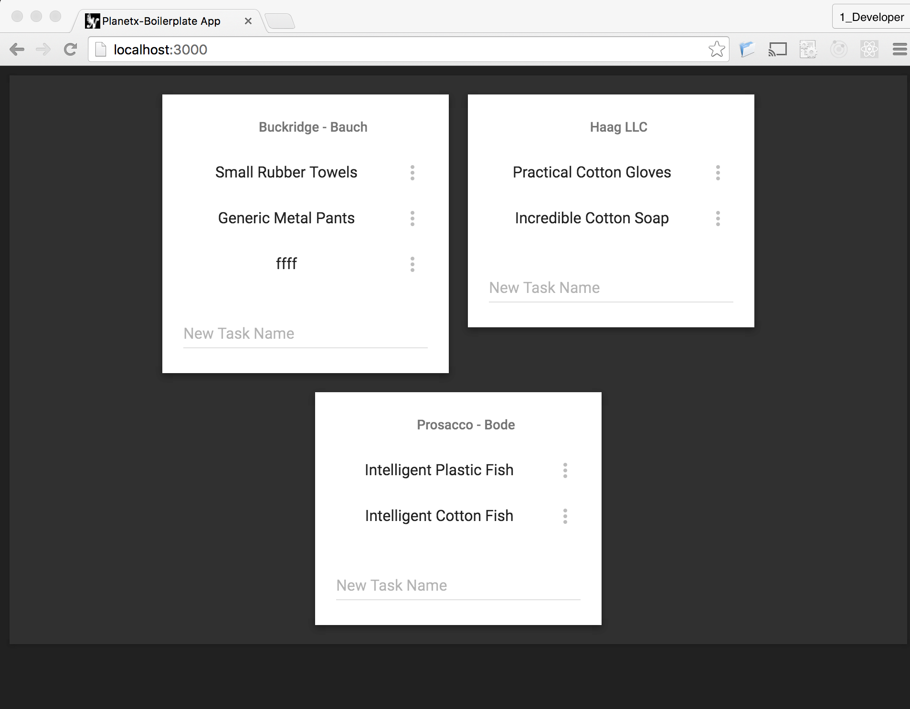

<h1><strong>Current Branch: '5/task_update-remove'</strong></h1>

<!-- TOC depthFrom:1 depthTo:3 withLinks:1 updateOnSave:0 orderedList:0 -->

- [About](#about)
  - [Screenshots](#screenshots)
  - [Caveats](#caveats)
  - [Differences from Meteor's React Todo Tutorial](#differences-from-meteors-react-todo-tutorial)
  - [Customizations](#customizations)
  - [Too Advanced? Start here...](#too-advanced-start-here)
  - [Later Versions](#later-versions)
- [Install](#install)
  - [Meteor Framework](#meteor-framework)
  - [App Node Dependencies](#app-node-dependencies)
- [Run & Dev-Build App](#run-dev-build-app)
- [Dev & Tutorials](#dev-tutorials)
  - [Project Structure](#project-structure)
  - [Tutorials and Learning](#tutorials-and-learning)
  - [Test App](#test-app)
- [About Meteor](#about-meteor)
  - [App Structure](#app-structure)
- [Author](#author)

<!-- /TOC -->


# About
This meteor app can be used as a boilerplate for starting a large scale production application. The major libraries are: React, Apollo, & Material. The imports directory contains a basic Todos application which can be used as example / sample code for your app. Other tutorials typically focus on a SPA application, but this is designed to be a Multipage boilerplate used for a real world application that will eventually have a team of developers.

Meteor is chosen as the NodeJS build framework because it is designed to reduce development time.

I have structured the app for a verbose file structure. A collaborative development environment, can cause many file changes in a day. My theory is that dissolving functionality as much as possible will reduce merge conflicts.

Running the provided application provides a router, accounts system, and a simple todos app. The app displays a user's "List of Tasks" on the home page and a profile page is accessible to registered users.

### Screenshots



### Caveats
I've been using Meteor for 1-year, which means that there are a lot of new changes in 1.3 and standards that have evolved while I was working with v=<1.2 . Making this boilerplate helps me in many ways, but most of all, to understand new standards that haven't solidified into common practice. If you have more than a year of production team engineering experience then you probably know more than me (so any Issues or PRs are appreciated). If you are experienced you will also understand who I'm building this boilerplate for.

### Differences from Meteor's React Todo Tutorial
* Multi Page App: Router, Profile, Auth
* Auth is custom accounts UI (not accounts-ui package)
* Responsive for "touch vs mouse" and "view size"
* Material UI
* Testing: BDD, Component/Container Tests, API Tests
* Apollo to access Mongo
* Babel/ES7
* Large Scale (vs "simple") app structure

### Customizations
##### Boilerplate
Create new modules of the following types with a boilerplate:
  * /imports/api/.boilerplate/
  * /imports/ui/components/.boilerplate/
  * /imports/ui/layouts/.boilerplate/
  * /imports/ui/pages/.boilerplate.jsx

```
$ cd /imports/api/
$ cp -rf .boilerplate todos
```

##### Symlinks
If you are making changes to the code (using this as a boilerplate for your project) and make changes to your meteor packages it is sometimes handy to have a symlink to it in your directory. Create it in your root directory by running
```
$ ln -s .meteor/packages meteor_packages
```

### Too Advanced? Start here...
*  [Meteor's Simple-React-Todos#a917718](https://github.com/meteor/simple-todos-react/tree/a91771830ad7e40b61bc93988e9c954e75d7a590)
*  [Abhi Ayer's How We Redux (and all their links)](https://medium.com/modern-user-interfaces/how-we-redux-part-1-introduction-18a24c3b7efe#.jylok6ems) - Viewed 20160601, Authored 20160110
*  More references in `/docs/References.md`

### Later Versions
For more, look at `/docs/Project.md` and search for `Gold Plating`

*  create History page and dependencies
*  create AdvancedList page and dependencies
*  convert Lists & Tasks into Tasks package
*  convert Accounts & Profiles into Accounts package

# Install
### Meteor Framework
Required for running the App
If this doesn't work for you [check the instructions (Link, 20160601)](https://www.meteor.com/install)
```
  $ curl https://install.meteor.com/ | sh
```


### App Node Dependencies
```
$ git clone https://github.com/Falieson/planetx-boilerplate.git
$ cd planetx-boilerplate
$ meteor npm i -S
```

# Run & Dev-Build App
Run the command, then Open your browser to localhost:3000
```
$ meteor
```

# Dev & Tutorials
### Project Structure
Start with the `/docs/` folder

1.        - Project Current Stage, Plan, History
1.  - Message and Notes
1.      - Sketch of final app structure
1.     - Tutorials and Repos
1.    - Some Regex and Mods from my Env

### Tutorials and Learning
Start with these two files, they are updated every commit

1. `/docs/Project.md`
1. `/docs/CommitJournal.md`


### Test App
Run the command in a new terminal window, then open your browser to `http://localhost:3100`
```
$ meteor test --driver-package practicalmeteor:mocha --port 3100
```
Changing the port to 3100 allows you to run a webserver on 3000. Running `meteor` and `meteor test` in separate terminals allows you to make changes to the code and each save the server will rebuild and rerun all \*.tests.\*. Keep a browser window open to each port and you can watch your changes made and tests pass simultaneously.

# About Meteor
### App Structure
* Client side code is async, while Server side is synchronous.
* Lazy Load all files in /client/ inside Meteor.isClient()
* Lazy Load all files in /server/ inside Meteor.isServer()
* All files in /imports/ use import/export file linking
* Modularize the app by exporting imports into /packages/

Refs:
* [Large Scale App Structure (Link, 20160601)](http://guide.meteor.com/structure.html)
* [Multiple Applications (Link, 20160601)](http://guide.meteor.com/structure.html#splitting-your-app)

# Author
Creator ~Falieson:20160602
